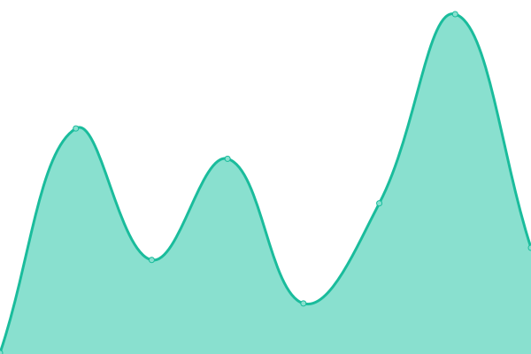

# [📈 Live Status](https://akiitr.github.io/uptime): <!--live status--> **🟧 Partial outage**

This repository contains the open-source uptime monitor and status page for [Anubhav Kumar](akiitr.github.io), powered by [Upptime](https://github.com/upptime/upptime).

With [Upptime](https://upptime.js.org), you can get your own unlimited and free uptime monitor and status page, powered entirely by a GitHub repository. We use [Issues](https://github.com/akiitr/uptime/issues) as incident reports, [Actions](https://github.com/akiitr/uptime/actions) as uptime monitors, and [Pages](https://akiitr.github.io/uptime) for the status page.

<!--start: status pages-->
<!-- This summary is generated by Upptime (https://github.com/upptime/upptime) -->
<!-- Do not edit this manually, your changes will be overwritten -->
<!-- prettier-ignore -->
| URL | Status | History | Response Time | Uptime |
| --- | ------ | ------- | ------------- | ------ |
|  [Google](https://www.google.com) | 🟩 Up | [google.yml](https://github.com/akiitr/uptime/commits/HEAD/history/google.yml) | 

 131ms
     
 | 

<a href="https://akiitr.github.io/uptime/history/google">100.00%</a>
    

|  [Blog](https://akiitr.github.io/) | 🟩 Up | [blog.yml](https://github.com/akiitr/uptime/commits/HEAD/history/blog.yml) | 

 147ms
     
 | 

<a href="https://akiitr.github.io/uptime/history/blog">100.00%</a>
    

|  [ASIC](https://akiitr.github.io/asic) | 🟩 Up | [asic.yml](https://github.com/akiitr/uptime/commits/HEAD/history/asic.yml) | 

 81ms
     
 | 

<a href="https://akiitr.github.io/uptime/history/asic">100.00%</a>
    

|  [Resume](https://akiitr.github.io/resume) | 🟩 Up | [resume.yml](https://github.com/akiitr/uptime/commits/HEAD/history/resume.yml) | 

 95ms
     
 | 

<a href="https://akiitr.github.io/uptime/history/resume">100.00%</a>
    

|  [IPv6 test](forwardemail.net) | 🟥 Down | [i-pv6-test.yml](https://github.com/akiitr/uptime/commits/HEAD/history/i-pv6-test.yml) | 

 0ms
     
 | 

<a href="https://akiitr.github.io/uptime/history/i-pv6-test">100.00%</a>
    

<!--end: status pages-->

[**Visit our status website →**](https://akiitr.github.io/uptime)

## 📄 License

- Powered by: [Upptime](https://github.com/upptime/upptime)
- Code: [MIT](./LICENSE) © [Anand Chowdhary](https://anandchowdhary.com), supported by [Pabio](https://pabio.com)
- Data in the `./history` directory: [Open Database License](https://opendatacommons.org/licenses/odbl/1-0/)
